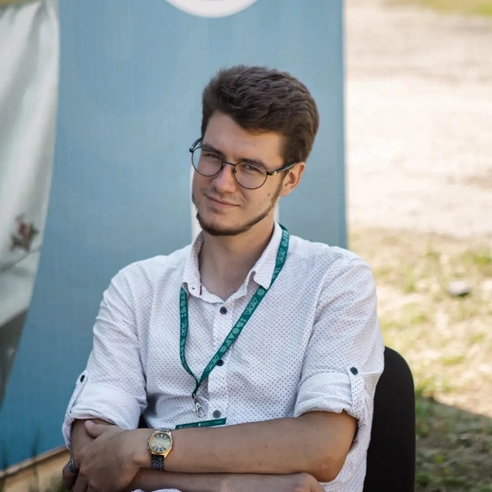

________________________________________________________________

# Исаев Александр Дмитриевич

## Контакты

* Номер телефона [+79678021421](+79678021421)
* E-mail: [alexisaev110400@gmail.com](alexisaev110400@gmail.com)

## Обо мне

Хочу поступить в аспирантуру в ФГБОУ ВО Вавиловский университет, 
научная специальность: 4.3.1 Технологии, машины и оборудование для 
агропромышленного комплекса. Предположительное направление научных 
изысканий – разработка и создание мобильной сервисной службы с 
применением технологии дополненной реальности.

## Публикации 

1. Статья УДК 621.22 Исаев А.Д., Миркина Е.Н. «Рабочие жидкости, 
применяемые в гидроприводах сельскохозяйственных машин» 
Материалы I Национальной научно-практической конференции с 
международным участием, 2019.
2. Статья УДК 631.3-82 Исаев А.Д., Миркина Е.Н. «Влияние загрязнения 
рабочих жидкостей на элементы гидропривода» Материалы IX 
Национальной конференции с международным участием Под. ред. Ф.К. 
Абразаков. 2019
3. Статья УДК 621.22 Исаев А.Д., Миркина Е.Н. «Режимы эксплуатации 
элементов гидропривода» Материалы VII Международной научно-
практической конференции. 2020
4. Статья УДК 621.22 Исаев А.Д., Миркина Е.Н. «Режимы эксплуатации 
элементов гидропривода» Журнал Наука и образование Мичуринский 
государственный аграрный университет. 2020
5. Статья УДК 631.28 Исаев А.Д., Миркина Е.Н. «Виды трения в 
гидравлических машинах» Материалы VIII Международной научно-
практической конференции. Саратов, 2021
6. Статья УДК 614.842-.847:614.847 Асаев А.Д., Левина И.В., Рыбалкин 
Д.А., Бахтиев Р.Н. «Переносная пожарная роботизированная установка 
для коленчатых автоподъемников АПК» Конкурс научно-
исследовательских работ 2020, Ассоциация разработчиков, 
изготовителей и поставциков средств индивидуальной защиты.

## Достижения 

1. Победитель и грантополучатель конкурса “Студенческий стартап - 
2022” Тема: “ Интеллектуальная система технического сервиса” Сумма 
гранта: 1 000 000, 00 руб.
2. Победитель конкурса “Студенческий стартап - 2022” Тема: “Разработка 
виртуальной реальности в техническом обслуживании и эксплуатации 
сельскохозяйственной техники”
3. Победитель и выставки научно-технических проектов молодежного 
форума ПФО “IВолга-2022” Тема проекта: “Интеллектуальная система 
технического сервиса.
4. Эксперт соревнований “Worldskills-2021” по направлению VR/AR.
5. Участник полуфинала защиты проектов в рамках весеннего проектно-
образовательного интенсива по модели Университета 20.35 “От идеи к 
прототипу” в 2022 году.
6. Участник конференции «Перспективы развития предпринимательства в 
молодежной среде».
7. Помощь в проведении Всероссийского конкурса АгроНТИ 2022 по 
направлению “АгроРоботы”.
8. Помощь в проведении Всероссийского конкурса АгроНТИ 2023 по 
направлению “АгроРоботы”.
9. Акт о внедрении результатов системы информационной поддержки 
технического обслуживания и ремонта тракторов и 
сельскохозяйственных машин; Академия ООО «Комбайновый завод 
Ростсельмаш» 2021.