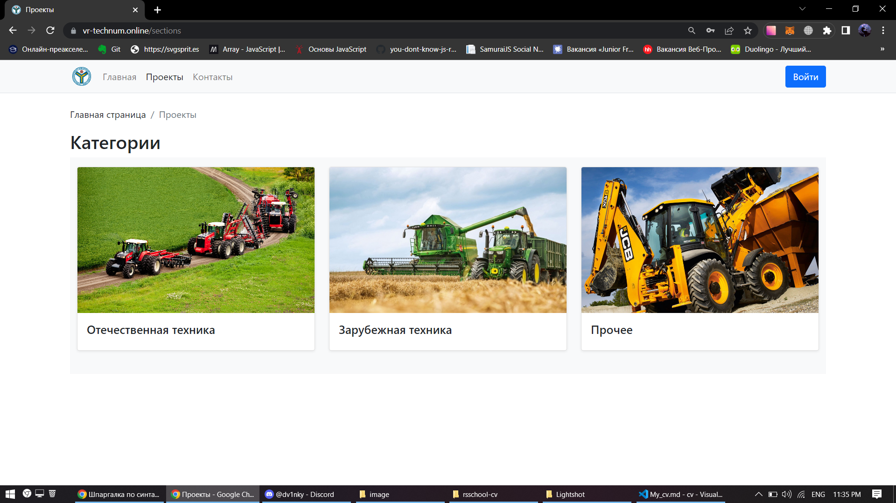
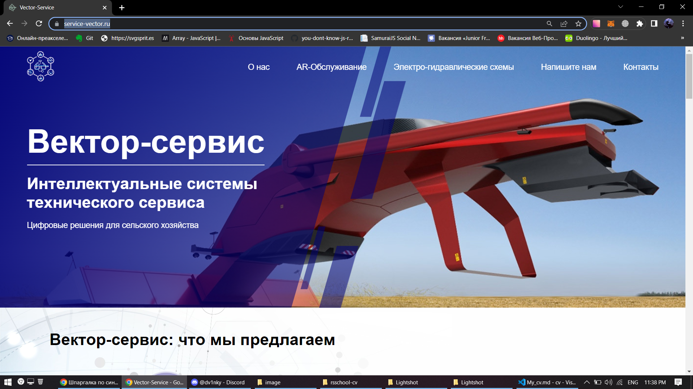
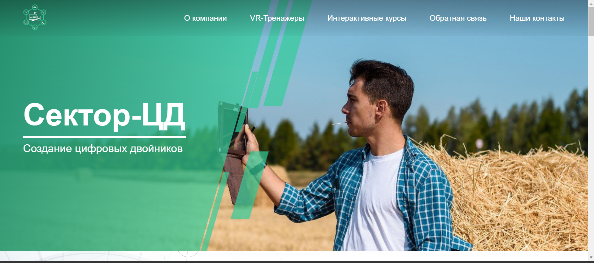
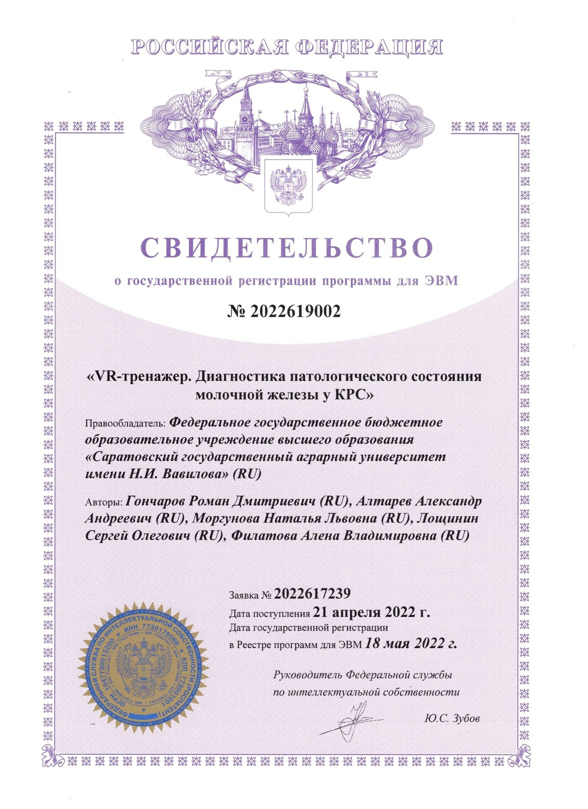

# Алтарев Александр Андреевич

## Контакты 

* Номер телефона: [+7(902)048-21-21](89020488121)
* Вконтакте: [Алтарев Александр](https://vk.com/alaisev)
* Email: [altarev123456@mail.ru](altarev123456@mail.ru)

## Обо мне 

Магистр 2-го курса факультета Инженирии и природообустройства направления подготовки 35.04.06 - Агроинженерия. В данный момент являюсь специалистом центра агророботехники VR/AR технологий по направлениям таким как: 

* 3D-разработка и прототипирование
* WEB-разработка
* Оператор лазерного станка
* Оператор лазерного маркера 
* Инженерное проектирование и черчение

## Умения 

* HTML
* CSS (LESS, SASA, SCSS)
* JavaScript (TypeScript)
* React JS
* Corel DRAW
* Blender 3D

## Публикации 

### [VR-Tehnum](https://vr-technum.ru/)

**Сайт.** Платформа для обучения студентов вузов и коледжей по обслуживанию техники специального назначения.

### [Vecrot-service](https://service-vector.ru/)

**Сайт.** Платформа для обучения студентов вузов и сузов по устройству и работе с сложными техническими машинами 

### [Sector-DT](https://sector-dt.ru//)

**Сайт.** Платформа по созданию цифровых двойников сельскохозяйственных объектов 

## Свидетельства регистрации ЭВМ

* Свидетельство о государственной регистрации программы для ЭВМ № [2021666580](https://www.elibrary.ru/item.asp?id=47118670&ysclid=lge3p772mv905521853) "Программа для разработки виртуального тренажера трактора "Беларус-1523", Соавторы: Жданов Д.А., Наянов А.В., Гончаров Р.Д.

 

* Свидетельство о государственной регистрации программы для ЭВМ № [2022619002](https://elibrary.ru/item.asp?id=48493961) "VR-ТРЕНАЖЕР. ДИАГНОСТИКА ПАТОЛОГИЧЕСКОГО СОСТОЯНИЯ МОЛОЧНОЙ ЖЕЛЕЗЫ У КРС", Соавторы: Гончаров Р.Д., Моргунова Н.Л., Лощинин С.О., Филатова А.В.

 

## Достижения 

* Победитель и грантополучатель конкурса умник архипелаг "Разработка приложения дополненной реальности для обучения техническому обслуживанию сельскохозяйственной техники" в 2021 году

* Эксперт по Всероссийским соревнования WordSkills Russia в 2020 году по напраплению VR/AR

