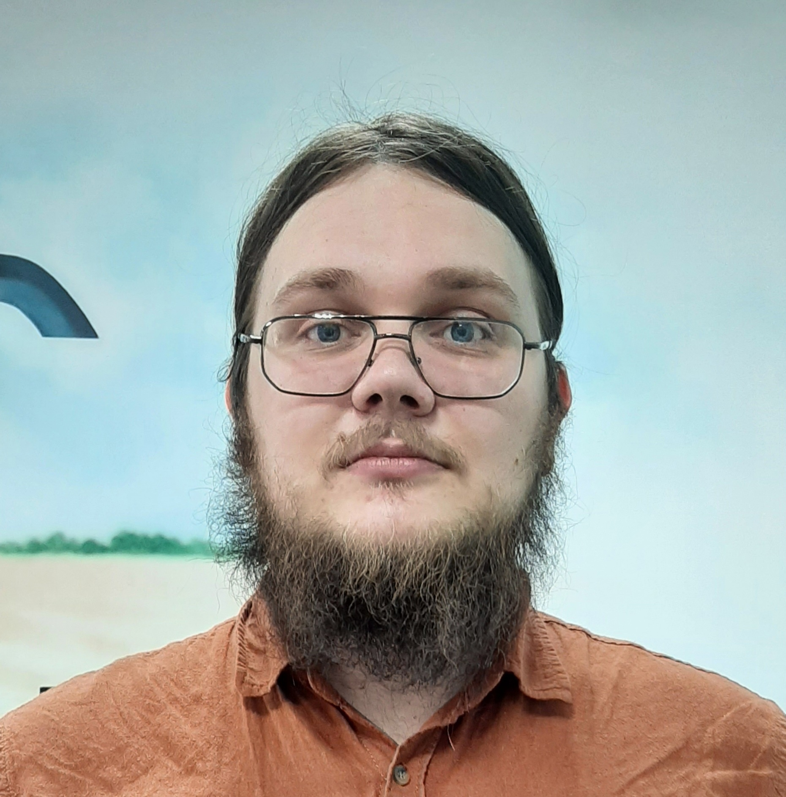

# Жданов Дмитрий Александрович

## Контакты

+ Номер телефона [+79061549397](tel:89061549397)
+ E-mail [zdanov.dz@gmail.com](mailto:zdanov.dz@gmail.com)

------------------------------------------------------------------------------------
## Обо мне

Магистрант 2 курса факультета инженерии и природообустройства, направление подготовки 35.04.06. - Агроинженерия. На данный момент являюсь специалистом центра Агророототехники и VR/AR технологий по направлению "Съемка 360".

------------------------------------------------------------------------------
## Публикации

+ Свидетельство о государственной регистрации программы для ЭВМ № [2021666580](https://www.elibrary.ru/item.asp?id=47118670&ysclid=lge3p772mv905521853) "Программа для разработки виртуального тренажера трактора "Беларус-1523", Соавторы: Алтарев А.А., Наянов А.В., Гончаров Р.Д.

    

+ Свидетельство о государственной регистрации программы для ЭВМ № [2022617980](https://www.elibrary.ru/item.asp?id=48492876) "Программа по ежесменному техническому обслуживанию для дополненной реальности по трактору Fendt 933/936", Соавторы: Гончаров Р.Д., Ерюшев М.В.

    

-----------------------------------------------------------------------------------
## Достижения

+ Победитель и грантополучатель конкурса "Умник-20" Тема: "Разработка технологий виртуальной реальности для обучения студентов по обслуживанию трактора «Беларус-1523», Сумма гранта: 500 000, 00 руб.

    

+ Победитель и грантополучатель конкурса "Студенческий стартап - 2022" Тема: "Разработка виртуальной реальности в техническом обслуживании и эксплуатации сельскохозяйственной техники" Сумма гранта: 1 000 000, 00 руб.

    

+ Победитель и грантополучатель выставки научно-технических проектов молодежного форума ПФО "IВолга-2022" Тема проекта: "Интеллектуальная система технического сервиса", Сумма гранта: 200 000,00 руб.

    
    
    

+ Эксперт соревнований "Worldskills-2022" по направлению VR/AR.

+ Прошел курс повышения квалификации "Коммерциализация инновационных проектов" при АНО "ФИРОН".

    

+ Участник VII Российско-Китайского молодежного форума в формате "Волга-Янцзы" в 2021 году.

    

+ Участник полуфинала защиты проектов в рамках весеннего проектно-образовательного интенсива по модели Университета 20.35 "От идеи к прототипу" в 2022 году.

    

+ Благодарность за активное сотрудничество и помощь в проведении Всероссийского конкурса АгроНТИ 2022 по направлению "АгроРоботы".

    